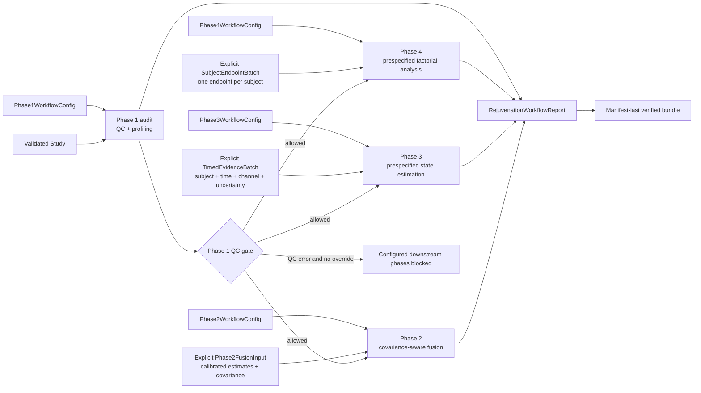

# Four-phase workflow orchestration

`rejuvenationkit.workflow` runs a validated Phase 1 audit and, when configured, the Phase 2
fusion, Phase 3 state estimator, and Phase 4 factorial analysis behind one fail-closed QC gate.
It publishes a machine-readable report with exact input, configuration, covariance, calibration,
endpoint, and result identities.

The runner coordinates already-defined scientific inputs. It does **not** infer timestamps from
estimand labels, turn a cohort-level fusion result into a subject trajectory, choose a latent
state endpoint, or construct a treatment endpoint after seeing the results.

## Execution structure



Phases 2–4 are separately configured branches after the common Phase 1 gate. Their phase numbers
describe the RejuvenationKit roadmap; the workflow does not pretend that the output of each phase
is automatically a scientifically valid input to the next phase.

| Phase | Required caller input | Main output | Boundary enforced by the runner |
|---|---|---|---|
| 1 | `Study` | `Phase1AuditReport` | The exact study hash and serialized QC policy are recorded. |
| 2 | `Phase2FusionInput` | `Phase2WorkflowResult` | Evidence IDs must align exactly with the supplied covariance; calibration and covariance identities are retained. |
| 3 | `TimedEvidenceBatch` | `Phase3WorkflowResult` | Every value already has an explicit subject, aware timestamp, channel, standard error, and typed calibration. |
| 4 | `SubjectEndpointBatch` | `Phase4WorkflowResult` | The caller supplies one prespecified endpoint per independent subject and its source-artifact identity. |

Every `PhaseDisposition` records whether its phase was `completed`, `skipped`, or `blocked`, why,
and the SHA-256 identities of artifacts consumed and produced.

## Phase 1 QC gate

Phase 1 always runs. If its `QCReport` contains an `ERROR`, every configured downstream phase is
blocked by default. Blocked phases retain input/configuration identities in their dispositions but
have no result or output artifact.

An exploratory run can cross that gate only by serializing the override in the Phase 1 audit
configuration:

```python
from rejuvenationkit.audit import Phase1AuditConfig

audit_config = Phase1AuditConfig(
    qc=qc_config,
    allow_analysis_with_qc_errors=True,
)
```

The report then sets `serialized_override_enabled=True` and, when errors were present and a
downstream phase was configured, `override_applied=True`. This is an auditable exception, not a
QC pass. It does not relax Phase 2 calibration/covariance validation, Phase 3 channel validation,
or Phase 4 factorial-design checks.

For confirmatory work, keep the default `False`, resolve the QC errors, and rerun the complete
request.

## Explicit, non-automatic phase boundaries

### Phase 2 to Phase 3

A Phase 2 fusion can represent one cohort contrast with no subject-level timestamps. Such a result
cannot be converted into a longitudinal state series from its name or `time_contrast` text.
The caller must construct a `TimedEvidenceBatch`; each `TimedEvidenceMeasurement` declares the
subject, aware timestamp, Phase 3 feature, uncertainty, estimand, and calibration reference.
Within a Phase 3 channel, complete estimand, species, tissue, assay, and calibration semantics must
agree exactly. Evidence IDs cannot be reused across times. The bridge retains those identities as
observation attributes and canonicalizes row order before computing its artifact hash.

Use this bridge only after a separately justified process has produced calibrated subject-level
values. A pathway enrichment, interaction-network result, or cohort-level effect is not a state
observation merely because it is biologically interesting.

### Phase 3 to Phase 4

A latent trajectory does not define its own treatment endpoint. State coordinate, time point,
baseline adjustment, and independent unit must be prespecified. Supply a `SubjectEndpointBatch`
directly, or explicitly call `state_report_to_endpoints()` with a `StateEndpointConfig` outside the
workflow and inspect that derived batch before using it in a subsequent request.

The workflow intentionally does not choose a favorable state or follow-up time and does not
manufacture a change-score standard error from marginal state covariances.

## Constructing and running a request

The complete request pairs optional configuration and input fields: a configured phase without
its typed input, or an input without its configuration, is rejected during model validation.

```python
from pathlib import Path

from rejuvenationkit.workflow import (
    RejuvenationWorkflowConfig,
    RejuvenationWorkflowInputs,
    RejuvenationWorkflowRequest,
    load_rejuvenation_workflow_report,
    run_rejuvenation_workflow,
)

request = RejuvenationWorkflowRequest(
    config=RejuvenationWorkflowConfig(
        phase1=phase1_config,
        phase2=phase2_config,
        phase3=phase3_config,
        phase4=phase4_config,
    ),
    inputs=RejuvenationWorkflowInputs(
        study=study,
        phase2=phase2_fusion_input,
        phase3=timed_evidence_batch,
        phase4=subject_endpoint_batch,
    ),
)

output_dir = Path("analysis/four-phase-bundle")
report = run_rejuvenation_workflow(request, output_dir=output_dir)
verified_report = load_rejuvenation_workflow_report(output_dir)
assert verified_report == report
```

A partial request is valid: omit both the configuration and input for any downstream phase that
should be skipped. The report still contains four ordered dispositions, so omission is explicit.

## Manifest-last publishing and verification

The runner first writes the complete bundle to a sibling staging directory. It verifies that the
staged file inventory exactly matches the Phase 1 audit inventory plus `workflow.json`, then
writes `workflow-manifest.json` last as the transaction marker. Publication replaces data files
before replacing the manifest.

The output directory has no-clobber protections:

- an unrelated file at a managed destination causes the run to fail;
- a previously managed file that was modified locally is not overwritten or deleted;
- a valid but locally reformatted workflow manifest is treated as modified and is not overwritten;
- a rerun can remove an unchanged stale managed artifact;
- unrelated files elsewhere in the output directory are preserved; and
- the manifest path is replaced last.

`load_rejuvenation_workflow_report()` requires both the report and manifest, checks every declared
file's byte count and SHA-256 digest, compares the report and manifest inventories, and validates
study and software identities. A crash before the new manifest is published, a missing file, or a
post-publication edit therefore produces a verification failure rather than a partially trusted
report.

The publisher and loader reject a symbolic-link output directory, a symbolic-link managed file,
or a symbolic link anywhere below the bundle root on the path to a managed artifact. Managed
artifacts therefore cannot escape the selected output directory through a pre-existing linked
subdirectory. Unrelated paths that are not managed artifact ancestors remain untouched.

The bundle layout is:

```text
four-phase-bundle/
├── phase1/
│   ├── audit.json
│   ├── findings.csv
│   └── ... other Phase 1 artifacts declared by the audit
├── workflow.json
└── workflow-manifest.json
```

Phase 2–4 results are embedded in `workflow.json`; their input, configuration, and result hashes
are also recorded in the corresponding disposition. The Phase 1 files stay in their own
subdirectory to avoid name collisions.

The Phase 3 result and its disposition use `StateEstimationReport.artifact_hash` directly. A
subsequent explicit state-to-endpoint bridge retains that same value as the endpoint batch's source
artifact identity. Phase 4 embeds that source identity in its combination report and cross-checks
it against the workflow result rather than trusting a free-standing disposition field.

## Deterministic synthetic example

Run the complete example with:

```bash
python examples/four_phase_workflow.py
```

By default it creates a temporary bundle, loads it through checksum verification, prints the four
phase dispositions and guardrails, and removes the temporary directory at exit. Library callers
can retain a bundle at an explicit safe path:

```python
from pathlib import Path

from examples.four_phase_workflow import main

main(Path("analysis/synthetic-workflow-bundle"))
```

The example explicitly constructs `Phase2FusionInput`, `TimedEvidenceBatch`, and
`SubjectEndpointBatch`. Its canine assignments, assay values, calibration labels, covariance,
latent-state model, and endpoints are all invented and deterministic. A completed phase means that
the declared software contract ran successfully. It is not evidence of efficacy, synergy,
causality, safety, or biological-age reversal.
