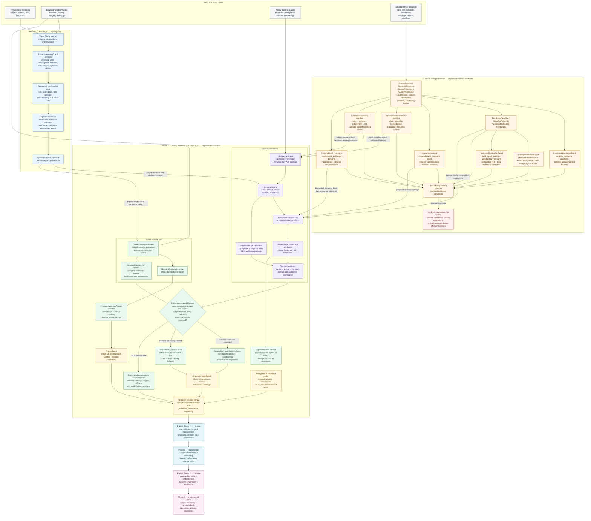

# Phase 2 architecture and research use cases

RejuvenationKit is a decision layer above established assay pipelines. Phase 1 asks whether the
study and longitudinal contrast are trustworthy. Phase 2 asks whether several measurements support
the same conclusion, how much independent information they contain, and where they disagree. The
external-context branch adds versioned biological annotations without treating database records or
enrichment p-values as measurements of efficacy.

The organization names below identify **workflow archetypes** suggested by their public areas of
research. They are not claims about any organization's internal software, unmet needs, data,
endorsement, or use of RejuvenationKit. “Acceleration” means reducing avoidable analysis rework,
making assumptions reviewable, and focusing the next experiment; it does not promise a shorter
biological, clinical, or regulatory timeline.

## System structure



The red boundary is intentional. External context may define a prespecified feature set, explain a
result, or supply inputs to an independently validated model. It does not itself measure whether an
animal improved.

## What crosses into fusion

The external-context models are immutable audit artifacts. They preserve exact resource, domain,
and content identity; query-derived results also bind the applicable query inputs and provenance.
They expose no `to_evidence()` method. Result types that define a fusion-eligibility field mark
themselves `not_fusible`; resource and definition objects enforce the same boundary by exposing no
evidence conversion at all.

| External artifact | Valid use now | Invalid interpretation | Permitted route toward Phase 2 evidence |
|---|---|---|---|
| `FunctionalGeneSet` and `GeneSetCollection` | Define versioned functional membership independently of the experimental outcome | Membership means that a pathway changed or that treatment worked | Prespecify weights and direction, create a `GeneSignature`, score each biological sample, and estimate a subject-clustered contrast |
| `OverrepresentationResult` | Explore whether a selected gene list overlaps tested terms more than expected under an explicit measured background | An adjusted p-value is an effect size, standard error, response direction, or efficacy probability | Use the finding to form a hypothesis for an independent cohort; do not reuse discovery significance as confirmatory evidence in the same data |
| `DirectionalRankedSetResult` | Explore where versioned gene sets concentrate in a fixed signed ranking under an explicit membership-permutation null | A signed enrichment score or adjusted p-value is a subject-level treatment effect, uncertainty estimate, causal mechanism, or efficacy probability | Prespecify the set and subject-level scoring rule for an independent cohort, or calibrate a named target with subject-grouped held-out data |
| `InteractionNetwork` | Inspect neighbors, modules, signs, provider mappings, and support channels | Provider confidence is treatment-effect magnitude, causal strength, or statistical precision | Declare a module or feature transform before outcome inspection, then validate its subject-level score or calibrate it on held-out subjects |
| `VariantAnnotationBatch` and `VariantAnnotationJoin` | Attach allele-, assembly-, consequence-, and frequency-aware context to dosage features | A consequence label or population frequency is intervention response | Retain dosage as the measured value, join annotation metadata exactly, and use a prespecified or held-out calibrated target model |
| `ExternalSequencingStudyManifest` | Preserve the study/sample/experiment/run hierarchy and document whether subjects are known | A sequencing run, library, or BioSample is automatically an independent animal | Resolve subject identity, process reads in an assay-specific pipeline, then construct a typed `GenomicMatrix` |
| `OrthologMap` and `OrthologTranslation` | Translate a prespecified signature under exact source/target domains while auditing missing, ambiguous, collided, and canceled weights | Database orthology proves conserved function or target-species validity | Preserve the translated definition and mapping provenance, then score and externally validate it in the intended species, tissue, assay, and population |

There are two valid conversion paths:

```text
independent resource gene set
    → prespecified GeneSignature
    → per-sample scores
    → subject-clustered contrast and covariance
    → pathway-specific evidence

prespecified annotation-derived features
    → GenomicMatrix
    → subject-grouped, held-out GenomicTargetCalibrator
    → prediction with empirical uncertainty and domain checks
    → evidence for the calibrated target
```

Even after the first route, “mTORC1 response,” “autophagy response,” and “inflammatory response”
are different estimands. Their joint covariance helps interpret the response vector; it does not
make them interchangeable components of one efficacy score. To express them on a common efficacy
scale requires a separate calibration against that declared endpoint.

The offline enrichment branch contains two deliberately separate contracts. Overrepresentation
analysis uses a one-sided hypergeometric test, requires selected features to be a subset of an
explicit background, filters terms inside that background, and is directionless. Directional
ranked-set analysis accepts a fixed, signed ranking and uses a weighted running-sum statistic with
membership permutations. Both apply an explicit local multiplicity policy and remain descriptive,
non-fusible results rather than subject-level efficacy estimates.

## Research-team archetypes

| Researcher archetype | Decision being accelerated | RejuvenationKit workflow | Concrete benefit | Scientific guardrail |
|---|---|---|---|---|
| **Rejuvenate Bio-like gene-therapy team** | Which construct, dose, vector lot, tissue, or follow-up experiment merits progression? | Audit site, assay run, manufacturing lot and visit balance; run prespecified pairwise contrasts; estimate tissue-specific signatures; compare commensurate genomic and clinical evidence with covariance and influence diagnostics | Makes a declared construct or dose comparison reviewable and identifies when a molecular conclusion is driven by handling or several correlated RNA readouts | The toolkit does not rank arbitrary multi-arm programs automatically; vector expression, biodistribution, network support and pathway enrichment are not phenotypic rejuvenation |
| **Genflow-like longevity gene-therapy team** | Does target engagement remain coherent across species, tissues, doses, and physiological endpoints? | Version ortholog translations, report mapping loss, score prespecified signatures, and validate each target-species/tissue result separately before considering any common-target calibration | Exposes cross-species information loss and separately validated molecular/clinical disagreement before a larger study | Orthology is not functional equivalence, and the toolkit does not fuse species by default; a human, canine or mouse model requires separate validation |
| **Calviri-like cancer-vaccine team** | Is immune activation accompanied by tumor or clinical benefit without an unacceptable inflammatory or toxicity pattern? | Use joint covariance for aligned genomic signatures; keep tumor, safety and clinical outputs as separately reviewed artifacts unless calibrated to one target; audit attrition and batches; use networks only for context | Prevents a strong immune biomarker from silently standing in for clinical benefit and makes efficacy–safety divergence visible | There is no generic cross-modal response-vector result yet; survival and clinical claims require the appropriate randomized design and censoring analysis outside a pathway score |
| **Dog Aging Project and veterinary researchers** | Is a canine longitudinal cohort analysis-ready, and when does a credible treated or unusual trajectory emerge? | Resolve expected visits relative to enrollment or dose, quantify visit-level missingness and attrition, retain incomplete modalities for separate or fusion analyses, and monitor onset/persistence only where the prespecified channels are complete | Separates visit logistics and loss to follow-up from biology while preserving usable dogs for analyses whose requirements they meet | Sequential scoring requires complete prespecified channels at retained visits; observational cohorts cannot establish a rapamycin effect without valid treatment assignment and causal assumptions |
| **Academic aging laboratory** | Is a mechanistic result reproducible enough to justify replication or a new perturbation? | Wrap curated assay outputs in typed contracts, preserve exact resource releases, run prespecified signatures and external benchmarks, and report assumptions with hashes | Produces a portable analysis artifact that collaborators can rerun and challenge instead of a one-off notebook result | Public benchmarks test software behavior in a bounded domain; they do not validate a universal clock or establish general efficacy |
| **Bioinformatician or computational biologist** | How can heterogeneous assay outputs become defensible decision inputs without rebuilding mature assay pipelines? | Keep DESeq2, edgeR, limma, Scanpy, aligners and callers upstream; use sparse matrices, explicit adapters, feature-effect aggregation, domain checks, resource provenance and calibrated evidence downstream | Supplies a typed interface and uncertainty-aware decision layer while preserving existing specialist tools | RejuvenationKit does not replace normalization, alignment, variant calling, cell-composition modeling, or biological interpretation |
| **Program lead, statistician or translational reviewer** | Is the evidence strong and robust enough for a go/no-go, dose-selection, replication, or data-remediation decision? | Review QC findings, effective sample sizes, covariance conditioning, heterogeneity, leave-one-out influence, missing modalities and complete provenance | Makes the reason for a conclusion—and what would reverse it—visible across disciplines | The output is research decision support, not medical advice, regulatory validation, or an automated treatment recommendation |

## Intervention and pathway use cases

| Program type | Question | Useful capabilities | What can be learned sooner | Boundary that remains |
|---|---|---|---|---|
| **Rapamycin** | Which dose, duration, age/sex stratum, tissue and biological program respond, and do potential safety signals diverge? | Randomized longitudinal effects where assignment is available; joint mTORC1, autophagy, NRF2 and inflammation signatures; subject-bootstrap covariance; separate clinical/genomic review or common-target calibration; public GSE131754 engineering benchmark | Whether response is coherent or pathway-specific, whether correlated signatures create false precision, and which stratum deserves confirmatory study | The public pathway panels are engineering fixtures, not validated clocks; distinct pathways remain a vector, and observational canine data do not establish rapamycin efficacy |
| **Partial reprogramming** | Do epigenetic or transcriptomic changes agree with tissue function, persist after dosing, and remain distinct from proliferation or dedifferentiation concerns? | Tissue- and species-specific matrix contracts, upstream validated clock outputs, sequential monitoring, covariance-aware molecular evidence, and separate safety estimands | Whether molecular-age movement precedes or disagrees with functional endpoints and whether the signal is persistent rather than transient | RejuvenationKit does not ship a biological-age clock; factor expression or movement of one upstream clock is target engagement, not proof of organismal rejuvenation |
| **Senolytic or immune-rejuvenation laboratory** | Does altered senescence or immune signaling accompany improved tissue function without infection, hematologic or inflammatory liabilities? | Prespecified pathway vectors, attrition and cell/assay batch audits, interaction-network context, longitudinal onset/persistence and multimodal influence analysis | Whether a response is systemic or modality-localized and whether benefit and immune-risk signals separate over time | Bulk expression can reflect cell-composition changes; depletion or cytokine biomarkers are not clinical benefit, and direction of inflammation is context-dependent |
| **Combination therapy program** | Does a prespecified outcome depart from additivity for two or more interventions, and is the design capable of identifying that departure? | Construct one endpoint per independent subject; audit all factorial cells and exclusions; fit declared main and interaction terms with classical or HC3 uncertainty, optional baseline/covariates, endpoint-precision policies, and local multiplicity correction; use the bounded two-by-two design helper before enrollment | Makes the scale-specific interaction, its uncertainty, missing cells, attrition, and rank/conditioning limitations visible before a biological synergy story is told | A coefficient is a departure from additivity on one declared scale—not automatic synergy, efficacy, mechanism, or safety—and causal interpretation still requires an appropriate assignment design |

## How the toolkit shortens the decision loop

1. **Declare the decision before choosing the metric.** Name the population, intervention
   contrast, time contrast, target, unit, and whether higher or lower is favorable.
2. **Audit trust before estimating efficacy.** Missing visits, attrition, batches, sites, plates,
   lanes and lots are checked against the intended contrast before they become model covariates or
   biological stories.
3. **Keep the biological unit visible.** Subjects—not genes, cells, aliquots, sequencing runs or
   embedding dimensions—drive independent-subject uncertainty.
4. **Represent high-dimensional assays without flattening them.** Sparse genome-scale matrices
   retain aligned sample, feature, scale and domain metadata until a prespecified score or held-out
   target prediction exists.
5. **Use external resources as context with an audit trail.** Exact resource, domain, and content
   identity travel with imported artifacts; query-derived result types additionally preserve their
   applicable input/query hashes, completeness, parameters, and warnings.
6. **Choose vector or fusion deliberately.** Different targets remain a multivariate response.
   Evidence-level fusion validates a complete estimand and domain policy; the lighter
   `ModalityEstimate` baseline checks a shared target and unique modalities and therefore requires
   additional caller discipline.
7. **Expose fragility.** Heterogeneity, covariance conditioning, negative or concentrated weights,
   missing modalities, disagreement and leave-one-out shifts show where another experiment would
   be most informative.

This changes the handoff from “the pathway plot looks promising” to a bounded statement such as:

> In this declared population and time contrast, two calibrated measurements of the same target
> agree after shared covariance is propagated; one clinical modality disagrees and materially
> changes the result when omitted; the inflammatory endpoint remains a separate safety estimand.

That statement is narrower than a universal rejuvenation claim, but it is much easier to review,
replicate, and use to design the next experiment.

## Scientific guardrails

- **Same estimand before fusion:** name, unit, direction, population, time contrast and transform
  must agree. Related biology is not enough.
- **Correlation before confidence:** measurements sharing subjects, features, training data or
  processing require covariance. More correlated scores do not automatically mean more
  independent evidence.
- **Explicit background for ORA:** the universe should represent features that could have been
  selected after measurement and filtering. The whole genome is not an automatic default.
- **Multiplicity remains visible:** the adjustment method, family definition and number of tested
  terms accompany every overrepresentation result.
- **P-values are not measurements:** neither raw nor adjusted enrichment p-values have the units or
  sampling meaning of a subject-level effect and standard error.
- **Direction is not invented:** overrepresentation is directionless. Up/down claims require the
  separate directional ranked-set contract, a fixed signed ranking, and its declared permutation
  and multiplicity policies.
- **Discovery and validation stay separate:** a pathway selected because it was significant in a
  cohort cannot become confirmatory evidence in that same cohort. Prespecify it for independent
  validation or calibrate it with leakage-safe held-out subjects.
- **Domain metadata are scientific constraints:** species, tissue, feature type, namespace, scale
  and genome assembly cannot be silently remapped. Ortholog and identifier mapping loss must be
  reported.
- **Database support is descriptive:** interaction confidence, variant consequence and population
  frequency are not intervention effects or causal evidence.
- **Variant equivalence is not invented:** the current importer splits alternate alleles and
  normalizes case, but otherwise uses exact coordinates and alleles on the named assembly.
  Left-align and minimize variants upstream against a versioned reference when equivalence
  normalization is required.
- **Technical entities are not independent animals:** sequencing runs, libraries, cells, genes and
  repeated samples do not increase independent-subject count by themselves.
- **Causal claims require design:** observational detection, biological-age movement and target
  engagement do not replace randomization or a justified causal model.
- **Research use only:** the toolkit does not diagnose disease, recommend treatment, validate a
  therapy for regulators, or replace veterinary, medical, pathology or statistical judgment.

## Implemented boundaries

Phases 1 through 4 are alpha capabilities. The external-context
branch imports saved, provider-neutral artifacts; it does not silently call live services or claim
that a present-day endpoint will remain unchanged. Assay preprocessing, alignment, variant calling,
cell-composition correction and clinical endpoint modeling remain upstream specialist work.
DataFrame context importers target bounded archived queries; the separate chunked store adds
resumable bounded-memory NDJSON and optional Parquet ingestion for large annotation, network, and
variant exports.

Phase 3 consumes explicitly timestamped scalar channels and never converts a text-only Phase 2
contrast into a trajectory. Phase 4 consumes one prespecified endpoint per independent subject and
never selects the most favorable latent state or time point automatically. The bridge contracts
make those scientific choices, uncertainty limitations, exclusions, and artifact identities
reviewable.
